# 學生練習手冊（乙本）

適用於 Assessments 學生短答練習｜繁體中文學生版

這本手冊教你開啟練習、輸入答案、查看解題步驟、列印 PDF，以及把成績提交給老師。
每次只跟着畫面做一個步驟便可以。

1. 使用基本要求
2. 開啟與認識畫面
3. 作答與題型鍵盤
4. 核對、回饋、解題及下一題
5. 結果、重做及歷史
6. 同類／整卷 PDF 與自行列印
7. 完整提交及提前遞交
8. 重複練習與重新抽題
9. 疑難排解

## 1 使用基本要求

### 1.1 裝置、瀏覽器與網絡

{{ include: INC_BASIC_REQUIREMENTS }}

### 1.2 開始前要懂的操作

開始前，確認你懂得：

1. 撳一下網頁上的按鈕。
2. 用虛擬鍵盤輸入數字和符號。
3. 用瀏覽器返回上一個分頁。
4. 向老師展示錯誤畫面，而不是自己改動設定。

提交成績時會用到學生證編號。不要把自己的學號或成績截圖傳給其他人。

## 2 開啟與認識畫面

### 2.1 開啟練習

1. 撳老師提供的練習連結。
2. 在「學生證編號」欄輸入自己的編號；如暫時不想填，可留空跳過。
3. 撳「開始」。填了編號但格式不正確時，網頁會提示你更正。
4. 同一分頁已有練習紀錄時，網頁會直接顯示結果頁，不會再次要求填寫編號。按「全部重做」便可返回練習。

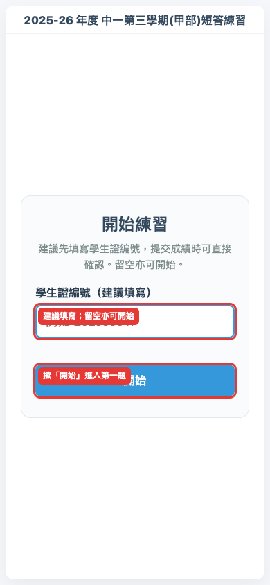

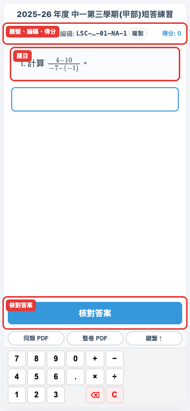

### 2.2 頂部資訊列

畫面頂部會顯示：

- 左邊：目前題號，例如 `Q1/16`。
- 中間：題目編碼及「複製」按鈕。
- 右邊：本輪目前得分。

如老師請你回報某一題，可撳「複製」取得完整題目編碼。平日作答不用理會編碼。

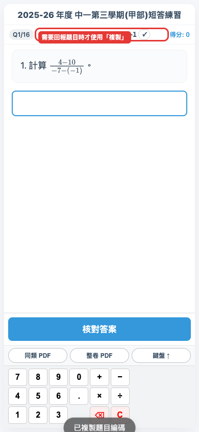

### 2.3 畫面分區

直向使用時，由上至下是：可捲動題目、答案輸入區、回饋／教學步驟、三個工具按鈕、三行虛擬鍵盤，以及核對／下一題按鈕。
題目較長時，只需在題目區內上下捲動；答案框和底部操作區會保持可見。橫向使用時，題目和答案在左，鍵盤及操作按鈕在右。

> 「核對答案」固定在鍵盤下方。核對後，同一位置會變成「下一題」。

## 3 作答與題型鍵盤

### 3.1 使用虛擬鍵盤

1. 在鍵盤左邊找數字。
2. 用固定的 `+`、`−`、`×`、`÷` 輸入四則運算。
3. 撳 `⌫` 刪除最後一個字元。
4. 撳 `C` 清除整個答案。

鍵盤固定為三行，每行九格，不用左右捲動。

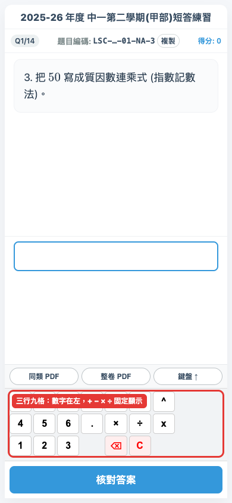

### 3.2 題型專用符號

不同題目會自動顯示需要的符號，例如：

- 分數：`/`
- 比例：`:`
- 圓周率：`π`
- 根式：`√`、`±`
- 指數：`^`
- 不等式：`>`、`<`、`=`、`≥`、`≤`
- 全等理由：`S`、`A`、`R`、`H` 和小數點

輸入分數、指數、π 或根式時，答案框會把已完成的部分排成數學格式。判分仍以你實際輸入的字元為準。

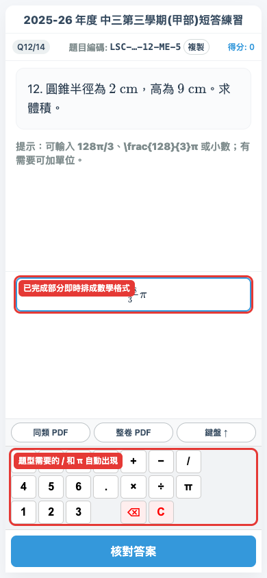

### 3.3 不用鍵盤的題目

部分題目不用一般鍵盤：

1. **選擇題**：直接撳一個選項。
2. **坐標題**：先在坐標平面點選位置，再按題目要求輸入坐標值。

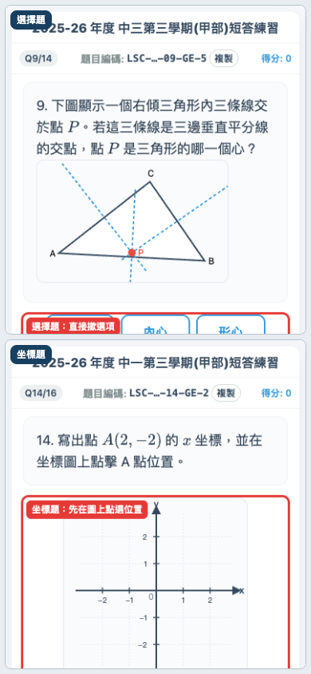

## 4 核對、回饋、解題及下一題

### 4.1 核對答案

1. 完成答案後，先看一次正負號、分數線和單位。
2. 撳「核對答案」。
3. 如答案仍是空白，網頁會提醒你先作答。

每題只在你撳「核對答案」後才會顯示結果。

### 4.2 看懂答對與答錯回饋

答對時，畫面顯示「✓ 正確！」。

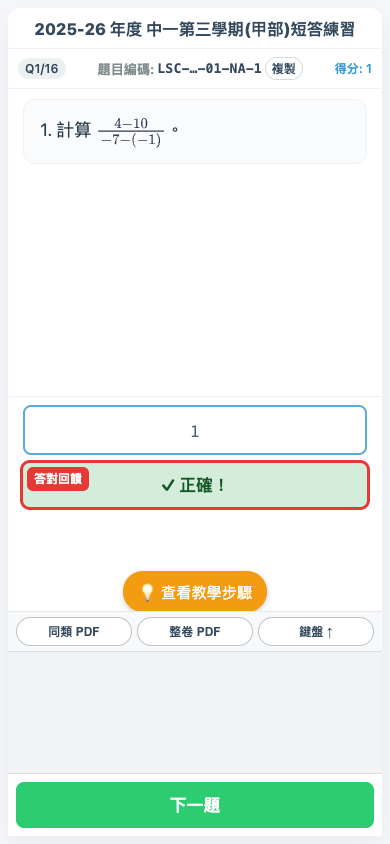

答錯時，畫面顯示「✗ 答錯。正確答案：」。分數、π、指數和根式會排成容易閱讀的數學格式。

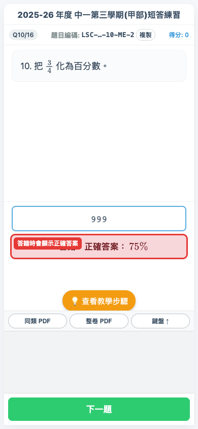

### 4.3 查看教學步驟

核對後會出現「💡 查看教學步驟」。

1. 撳一下展開解題方法。
2. 看清楚每一步算式和圖像。
3. 再撳一次可收起解說。

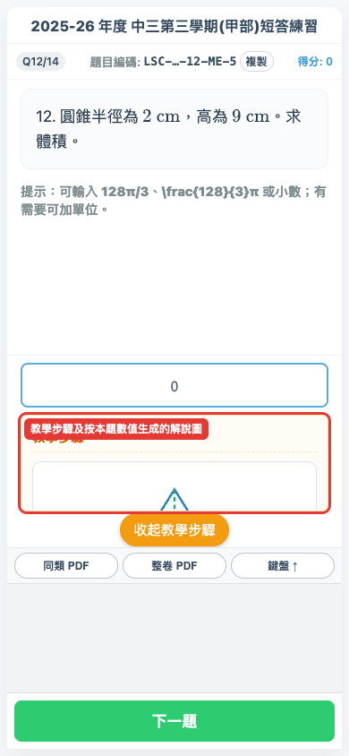

### 4.4 前往下一題

核對後，鍵盤下方的「核對答案」會在原來位置變成「下一題」。

1. 看完回饋和教學步驟。
2. 撳「下一題」。
3. 新題目會清空答案框並恢復鍵盤。

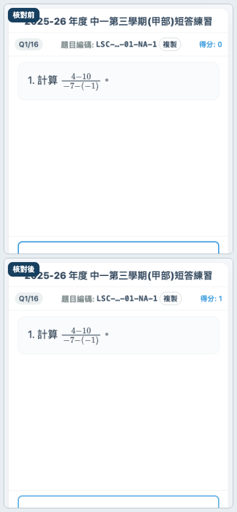

## 5 結果、重做及歷史

### 5.1 完成畫面

做完本輪所有題目後，畫面顯示：

- 本輪分數。
- 「全部重做」和「重做錯題」。
- 「整卷 PDF 雙版」。
- 「提交答案至老師」。
- 歷次嘗試紀錄。

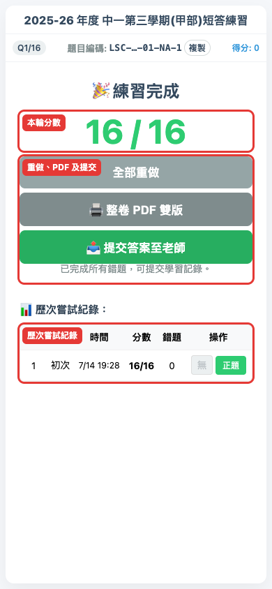

### 5.2 全部重做與重做錯題

- **全部重做**：確認提示後，再做本次載入的整份題目；本次開啟期間的歷次紀錄不會清除。
- **重做錯題**：只做剛才答錯的題目。

如有錯題，「提交答案至老師」會保持停用。把所有錯題重做並答對後，按鈕才會開放。

### 5.3 查看紀錄及單題重做

1. 在「歷次嘗試紀錄」找出一次練習。
2. 撳「錯題」或「正題」查看詳情。
3. 撳「重做此題」可只重做該題。

單題重做不會刪除原本紀錄。

> 歷次紀錄只在本次開啟練習的分頁內保留。關閉分頁或瀏覽器後，紀錄便會清除。

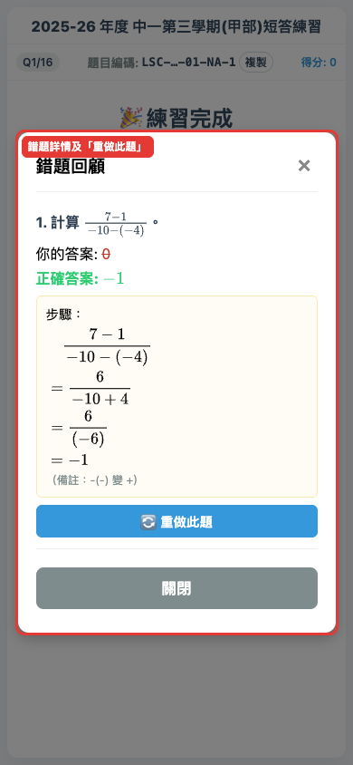

## 6 同類／整卷 PDF 與自行列印

### 6.1 三個工具按鈕

回饋／教學步驟與鍵盤之間有三個按鈕：

1. 「同類 PDF」
2. 「整卷 PDF」
3. 「鍵盤 ↑」或「鍵盤 ↓」

如鍵盤被手機底部遮住，撳「鍵盤 ↑」。答案框、工具按鈕、鍵盤和核對按鈕會一同上移，答案框仍然可見；切換題目後，上調狀態會保留。

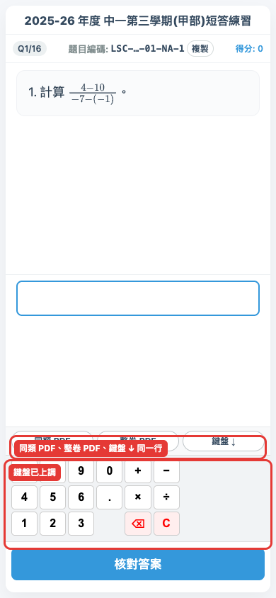

### 6.2 同類 PDF

「同類 PDF」會按目前題型重新抽取最多五題練習：

1. 第一部分只有題目。
2. 第二部分有同一批題目的答案和教學步驟。

如這個題型沒有其他變式，按鈕會停用並顯示提示。

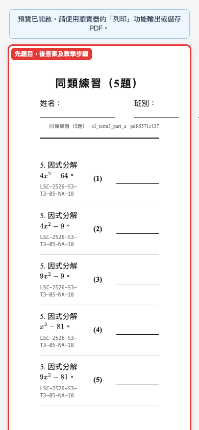

### 6.3 整卷 PDF

「整卷 PDF」會另外抽取一份完整練習，並在同一預覽分頁顯示：

1. 學生題目版。
2. 教師答案版。

開啟 PDF 不會改變畫面上正在作答的題目。

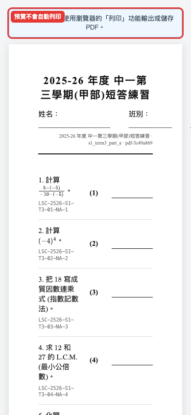

### 6.4 自行列印或儲存 PDF

PDF 只會開啟預覽，不會自動列印。手機或 iPad 會按畫面寬度顯示預覽。

{{ include: INC_BROWSER_PRINT }}

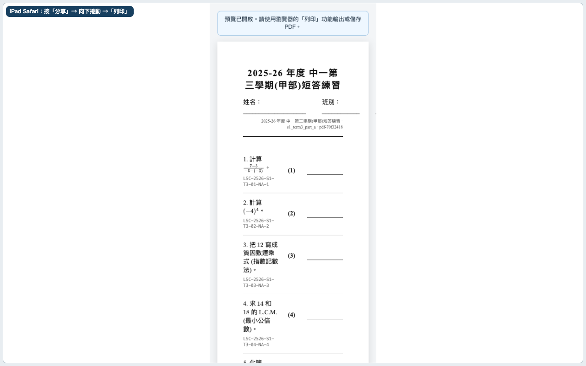

## 7 完整提交及提前遞交

### 7.1 提交前準備

完整提交前，你需要：

1. 完成本輪所有題目。
2. 把所有錯題重做並答對。
3. 準備自己的學生證編號。

{{ include: INC_STUDENT_ID_PRIVACY }}

### 7.2 完整提交

完整提交不需要老師密碼。

1. 在結果頁確認「提交答案至老師」已開放。
2. 撳「提交答案至老師」。
3. 如開始時已填學生證編號，瀏覽器會預填該編號，請確認或修改；如開始時跳過，請在這時輸入。
4. 確認格式正確後送出。

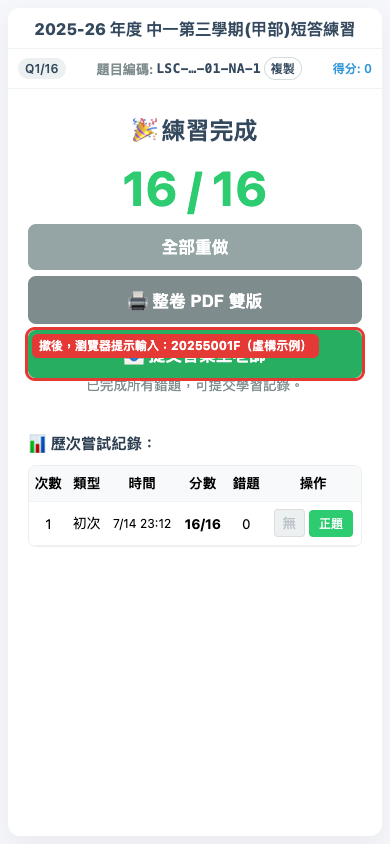

{{ include: INC_SUBMISSION_STATUS }}

### 7.3 何時會見到提前遞交

「提前遞交」只在你未完成全卷，而且老師已為這份練習設定提交功能和密碼時出現。

> 此功能只在老師設定了密碼的練習中出現。若你手上的練習沒有「提前遞交」按鈕，即表示不支援提前遞交，做完全部題目再提交即可。

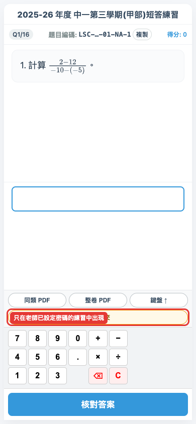

### 7.4 提前遞交流程

提前遞交只提交你已作答的部分。未作答題目不會計入得分，但全卷總題數保持不變。

1. 撳「提前遞交」。
2. **請舉手請老師來輸入密碼。**
3. 老師完成授權後，確認預填的學生證編號；如開始時跳過，才在這時輸入。
4. 等候「已嘗試送出」提示。

不要問同學密碼，也不要嘗試猜密碼。

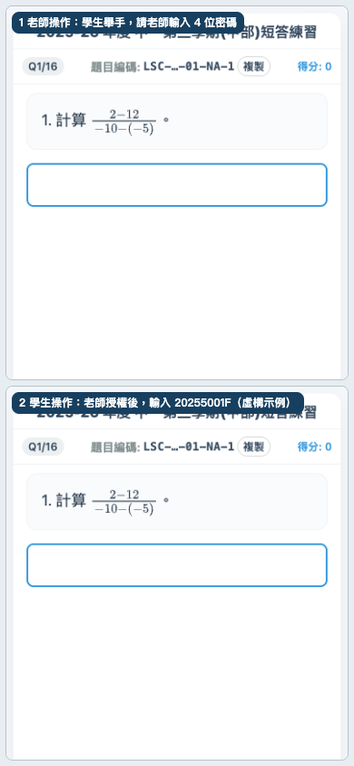

### 7.5 遞交後繼續作答

提前遞交後，網頁會保留目前題號和答案狀態。

1. 繼續完成餘下題目。
2. 如老師要求，可再次提前遞交。
3. 全部完成並清除錯題後，仍可使用正常提交。

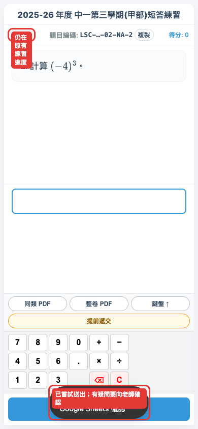

## 8 重複練習與重新抽題

### 8.1 再做一份新練習

**每次載入練習，題目數字會不同（重新抽題）。**

要再抽一份：

1. 重新載入或重新開啟練習頁。
2. 如先看到舊結果頁，撳「全部重做」。
3. 比較新題目和上一次的數字。

隨機抽題有機會偶然抽到相同數字，這是正常情況。

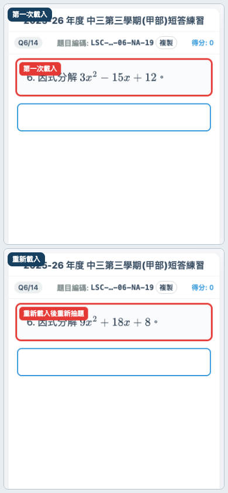

### 8.2 分辨重做與重新抽題

- 在同一頁按「全部重做」：重用這次載入的題目。
- 按「重做錯題」或「重做此題」：重用相同題目，方便改正。
- 重新載入／重新開啟頁面：重新抽取題目數字。

## 9 疑難排解

### 9.1 常見操作問題

- **同類 PDF 停用**：這個題型暫時沒有其他變式。
- **提交按鈕停用**：先完成所有錯題重做，或請老師檢查提交設定。
- **看不到提前遞交**：這份練習未設定老師密碼；完成全部題目後正常提交。
- **鍵盤被遮住**：撳「鍵盤 ↑」讓整個底部操作區上移，或把瀏覽器工具列收起。
- **同一分頁開啟時先見結果頁**：本次開啟期間已有紀錄；撳「全部重做」。關閉分頁後紀錄會清除。

### 9.2 網絡、PDF 與提交問題

{{ include: INC_COMMON_TROUBLESHOOTING }}

PDF 預覽未開啟時，檢查瀏覽器有沒有阻擋新分頁。數學式未排好時，等候網絡載入後再試。

{{ include: INC_SUBMISSION_STATUS }}
